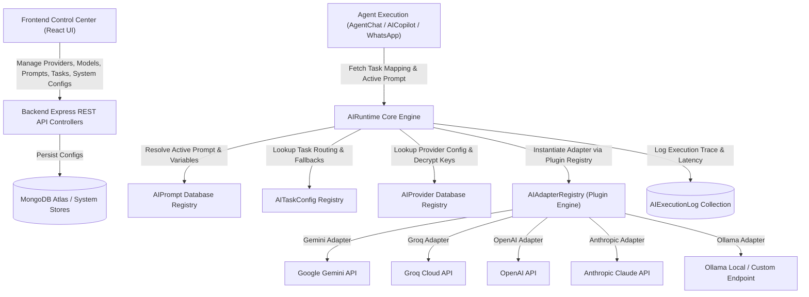
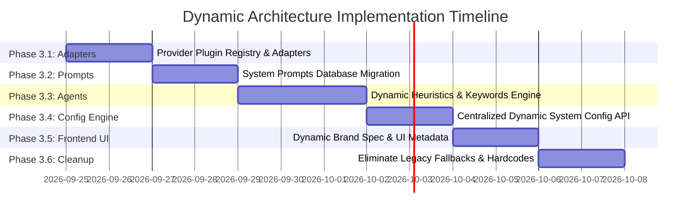

# 🏛️ Dynamic Architecture Audit & Refactoring Master Plan
**Version:** 1.0.0 | **Date:** 2026-09-24 | **Target Scope:** Entire AutoFlow Monorepo (`apps/`, `packages/`)  
**Core Philosophy:** *Configuration-Driven System over Code-Driven System. Zero Hardcoding, Zero Static Fallbacks, 100% Frontend-Driven Dynamic Control.*

---

## 📋 Table of Contents
1. [Executive Summary & Vision](#-executive-summary--vision)
2. [Phase 1 — Complete Audit](#-phase-1--complete-audit)
   - [1.1 AI/LLM Provider & Model Layer Debt](#11-aillm-provider--model-layer-debt)
   - [1.2 AI Agent & Workflow Engine Debt](#12-ai-agent--workflow-engine-debt)
   - [1.3 Conversational Agent Chat & WhatsApp Agent Debt](#13-conversational-agent-chat--whatsapp-agent-debt)
   - [1.4 AI Data Bridge & Field Mapping Debt](#14-ai-data-bridge--field-mapping-debt)
   - [1.5 Frontend Hardcoded Logic & UI Static Debt](#15-frontend-hardcoded-logic--ui-static-debt)
   - [1.6 Business Logic, Conditional Branching & Fallback Debt](#16-business-logic-conditional-branching--fallback-debt)
   - [1.7 Audit Summary Matrix](#17-audit-summary-matrix)
3. [Phase 2 — Target Dynamic Architecture & Design](#-phase-2--target-dynamic-architecture--design)
   - [2.1 Universal Extensible Provider Plugin System](#21-universal-extensible-provider-plugin-system)
   - [2.2 Dynamic AI Control Plane Architecture](#22-dynamic-ai-control-plane-architecture)
   - [2.3 Dynamic Agent & Workflow Engine Architecture](#23-dynamic-agent--workflow-engine-architecture)
   - [2.4 Dynamic Prompt Engine & Template Registry](#24-dynamic-prompt-engine--template-registry)
   - [2.5 Centralized Feature & Dynamic Configuration Engine](#25-centralized-feature--dynamic-configuration-engine)
   - [2.6 Schema Validation, Versioning & Change Audit](#26-schema-validation-versioning--change-audit)
   - [2.7 Error Handling Strategy without Hardcoded Fallbacks](#27-error-handling-strategy-without-hardcoded-fallbacks)
4. [Phase 3 — Phased Incremental Implementation Plan](#-phase-3--phased-incremental-implementation-plan)
   - [Phase 3.1: Extensible AI Provider Plugin System & Universal Adapters](#phase-31-extensible-ai-provider-plugin-system--universal-adapters)
   - [Phase 3.2: Dynamic Prompt Engine & System Instruction Centralization](#phase-32-dynamic-prompt-engine--system-instruction-centralization)
   - [Phase 3.3: Decoupled Agent System & Dynamic Heuristic Engine](#phase-33-decoupled-agent-system--decoupled-heuristic-engine)
   - [Phase 3.4: Dynamic Configuration & Feature Control Engine](#phase-34-dynamic-configuration--feature-control-engine)
   - [Phase 3.5: Dynamic Frontend UI & Brand Asset Registry](#phase-35-dynamic-frontend-ui--brand-asset-registry)
   - [Phase 3.6: Cleanup & Complete Elimination of Legacy Fallbacks](#phase-36-cleanup--complete-elimination-of-legacy-fallbacks)
5. [Phase 4 — Testing & Quality Assurance Strategy](#-phase-4--testing--quality-assurance-strategy)
   - [4.1 Unit & Schema Validation Testing](#41-unit--schema-validation-testing)
   - [4.2 Provider & Model Compatibility Matrix Tests](#42-provider--model-compatibility-matrix-tests)
   - [4.3 Dynamic Configuration & Feature Toggle Tests](#43-dynamic-configuration--feature-toggle-tests)
   - [4.4 Agent Behavior & Workflow Generation Tests](#44-agent-behavior--workflow-generation-tests)
   - [4.5 End-to-End API & UI Tests](#45-end-to-end-api--ui-tests)
6. [Phase 5 — Full Regression & System Verification Protocol](#-phase-5--full-regression--system-verification-protocol)
   - [5.1 Comprehensive Verification Checklist](#51-comprehensive-verification-checklist)
   - [5.2 Operational Checklist for Adding New Features without Code Changes](#52-operational-checklist-for-adding-new-features-without-code-changes)
   - [5.3 Architectural Compliance Matrix](#53-architectural-compliance-matrix)

---

## 🎯 Executive Summary & Vision

The objective of this refactoring is to transition AutoFlow from a **partially hardcoded, code-driven application** into a **100% configuration-driven dynamic automation platform**.

Currently, adding a new AI provider (e.g. OpenAI, Anthropic, Ollama, Azure OpenAI), a new model, a new agent capability, a connector branding rule, or a workflow heuristic requires modifying TypeScript source code across multiple backend services and frontend components.

### Core Architectural Mandates:
1. **Zero Hardcoded LLM Models / Providers:** All AI providers and models must be managed dynamically from the database and controllable via the frontend UI.
2. **Dynamic Provider Adapter Factory:** Provider adapters must be registered dynamically through an extensible plugin registry, eliminating `switch` statements and hardcoded provider checks.
3. **Prompt & Behavior Decoupling:** Every system prompt, guardrail, output rule, and template variable must be managed in the `AIPrompt` registry and editable from the frontend.
4. **Dynamic Agent Heuristics:** Agent keyword rules, destructive action definitions, alias lists, fallback templates, and tool discovery must be fetched dynamically from configuration schemas or connector manifests.
5. **Frontend-Driven Control:** All system configurations, feature flags, default execution parameters, brand themes, and UI widgets must be driven by API metadata rather than hardcoded client-side dictionaries.
6. **Robust Error Handling without Silently Swallow Fallbacks:** When a service fails, the system must follow configured dynamic routing policies (e.g., fall back to Model B as defined in `AITaskConfig`), validate errors with precise schemas, and report detailed diagnostics rather than hiding errors behind static hardcoded mock responses.

---

## 🔍 Phase 1 — Complete Audit

### 1.1 AI/LLM Provider & Model Layer Debt
* **File:** `apps/backend/src/modules/ai-runtime/ai-runtime.service.ts`
  * **Finding:** `AIRuntimeService.getAdapter(providerDoc)` uses a static `switch (providerDoc.providerId)` statement with hardcoded cases (`'gemini'`, `'groq'`).
  * **Impact:** Adding support for OpenAI, Anthropic, Ollama, Mistral, or Azure OpenAI via the frontend DB interface causes runtime exceptions ("No adapter implemented for provider").
  * **Finding:** Missing OpenAI, Anthropic, Ollama, and Azure OpenAI adapters.
  * **Finding:** Hardcoded temperature fallback (`0.7`) in `testPrompt()` method.
* **File:** `apps/backend/src/modules/ai-runtime/adapters/`
  * **Finding:** Adapters (`GeminiAdapter`, `GroqAdapter`) have hardcoded error mapping logic and static API payload formatters instead of using a unified SDK or OpenAPI specification for LLM completion requests.

### 1.2 AI Agent & Workflow Engine Debt
* **File:** `apps/backend/src/modules/ai-agent/ai-agent.service.ts`
  * **Finding:** `DYNAMIC_WORKFLOW_SYSTEM_PROMPT` is defined as a massive 50-line static string constant containing hardcoded lists of 13 connectors (`autoflow-schedule`, `web-search`, `web-browser`, `gmail`, `google-sheets`, etc.).
  * **Finding:** `buildDynamicFallbackWorkflow()` contains over 160 lines of hardcoded `if/else` logic, static regex string matches (`lower.includes('whatsapp')`, `lower.includes('github')`, `lower.includes('sheet')`), hardcoded spreadsheet titles (`'React_Developer_Jobs_Log'`), and static node position math (`y: 80 + idx * 270`).
  * **Finding:** `processCopilotChat()` contains over 220 lines of hardcoded string matching (`lower.includes('delete')`, `lower.includes('add')`, `lower.includes('sheet')`, `lower.includes('trigger')`) with static node mutation logic when LLM output fails or falls back.
  * **Finding:** Hardcoded mapping of connector identifiers (e.g. `'gmail-read' => 'gmail'`) inside execution logic.

### 1.3 Conversational Agent Chat & WhatsApp Agent Debt
* **File:** `apps/backend/src/modules/agent-chat/agent-chat.service.ts`
  * **Finding:** `CONNECTOR_KEYWORD_ALIASES` is a static TypeScript dictionary mapping 22 connectors to hardcoded keyword arrays.
  * **Finding:** `DESTRUCTIVE_KEYWORDS` (`'delete'`, `'remove'`, `'drop'`, `'truncate'`) and `DESTRUCTIVE_ACTION_IDS` (`'delete_one'`, `'delete_many'`, `'drop_collection'`) are hardcoded in code.
  * **Finding:** Two-Tier connector injection budget logic has fixed thresholds (`connectedApps.length <= 10`, `slice(0, 25)`, `slice(0, 10)`).
* **File:** `apps/backend/src/modules/whatsapp-agent/agent-runtime.service.ts`
  * **Finding:** System instruction formatting, fact limit thresholds (`limit(10)`), memory extraction prompt, and fallback response strings are hardcoded in code.

### 1.4 AI Data Bridge & Field Mapping Debt
* **File:** `packages/ai-data-bridge/src/ai-data-bridge.ts`
  * **Finding:** System prompt template for dynamic field coercion is defined as a static multi-line string in TypeScript.
  * **Finding:** Hardcoded fallback field matchers and static JSON parsing rules.

### 1.5 Frontend Hardcoded Logic & UI Static Debt
* **File:** `apps/frontend/src/lib/connector-brand-utils.ts`
  * **Finding:** `getConnectorBrandSpec()` is a 230-line `if/else` chain matching connector IDs (`cid.includes('openai')`, `cid.includes('anthropic')`, `cid.includes('google')`, `cid.includes('slack')`, etc.) to return hardcoded Tailwind color names, background glow gradients, and Lucide icons.
* **File:** `apps/frontend/src/app/(dashboard)/connectors/page.tsx`
  * **Finding:** Hardcoded dictionary of auth configuration templates (`openai`, `anthropic`, `gemini`, `groq`) with static help text and documentation links.
  * **Finding:** Hardcoded category lists and connector search placeholders.
* **File:** `apps/frontend/src/components/builder/FieldMapper.tsx`
  * **Finding:** Hardcoded action config specifications for AI connectors (`openai`, `anthropic`, `gemini`, `groq`).
* **File:** `apps/frontend/src/components/builder/AppPickerModal.tsx`
  * **Finding:** Hardcoded list of connectors and search placeholders (`Search 50+ integrations...`).
* **File:** `apps/frontend/src/app/(dashboard)/ai-agent/page.tsx`
  * **Finding:** Hardcoded UI status badges (`Gemini 3.6 Flash / Groq Active`).

### 1.6 Business Logic, Conditional Branching & Fallback Debt
* **File:** `apps/backend/src/app.ts`
  * **Finding:** Global monkey-patching `(global as any).aiRuntimeExecute = AIRuntimeService.execute;` instead of proper dependency injection or NestJS/Express service container.
* **File:** `apps/backend/src/modules/workflow-engine/` & `packages/connector-sdk/`
  * **Finding:** Static step execution timeout defaults, hardcoded retry limits, and static fallback error handlers.

### 1.7 Audit Summary Matrix

| Module | Location | Current Debt | Target Dynamic Architecture |
| :--- | :--- | :--- | :--- |
| **AIRuntime Adapters** | `ai-runtime.service.ts` | Static `switch` for Gemini & Groq | Dynamic Adapter Plugin Registry (`AIAdapterRegistry`) |
| **System Prompts** | `ai-agent.service.ts`, `ai-data-bridge.ts` | In-code static prompt string constants | Database-stored, versioned `AIPromptModel` items editable via UI |
| **AI Co-Pilot Heuristics** | `ai-agent.service.ts` | 380+ lines of hardcoded `if/else` fallbacks | Dynamic Heuristic Engine + DB Rule Registry |
| **Connector Aliases & Keywords** | `agent-chat.service.ts` | Hardcoded `CONNECTOR_KEYWORD_ALIASES` object | Derived dynamically from Connector Manifest `keywords` & `tags` |
| **Destructive Actions** | `agent-chat.service.ts` | Hardcoded `DESTRUCTIVE_ACTION_IDS` set | Schema metadata property (`action.isDestructive: true`) |
| **Frontend Brand Utils** | `connector-brand-utils.ts` | 230-line `if/else` matching string IDs | Metadata-driven brand spec derived from Connector Manifest `uiSchema.brand` |
| **Connector Auth Specs** | `connectors/page.tsx` | Hardcoded auth help text dictionary | API `/v2/connectors/:id/auth-spec` endpoint driven by DB manifests |

---

## 🏗️ Phase 2 — Target Dynamic Architecture & Design



### 2.1 Universal Extensible Provider Plugin System
Instead of hardcoding provider adapters in a `switch` statement, create an **`AIAdapterRegistry`**:
```typescript
export interface AIAdapterFactory {
  createAdapter(providerDoc: IAIProvider): BaseAIAdapter;
}

export class AIAdapterRegistry {
  private static factories = new Map<string, AIAdapterFactory>();

  static registerProvider(providerId: string, factory: AIAdapterFactory): void {
    this.factories.set(providerId.toLowerCase(), factory);
  }

  static getAdapter(providerDoc: IAIProvider): BaseAIAdapter {
    const factory = this.factories.get(providerDoc.providerId.toLowerCase());
    if (!factory) {
      // Check if provider is OpenAI-compatible (supports custom baseUrl)
      if (providerDoc.isOpenAICompatible) {
        return new OpenAICompatibleAdapter(providerDoc);
      }
      throw new Error(`AI Control Plane: No adapter factory registered for provider '${providerDoc.providerId}'`);
    }
    return factory.createAdapter(providerDoc);
  }
}
```
* **Supported Adapters:** Gemini, Groq, OpenAI, Anthropic, Ollama, Azure OpenAI, and generic OpenAI-Compatible (vLLM, DeepSeek, LocalAI, Together AI, Mistral API).

### 2.2 Dynamic AI Control Plane Architecture
The `AITaskConfig` model will serve as the runtime router contract:
- **`feature`** (e.g. `agent-chat`, `ai-copilot`, `whatsapp`, `data-bridge`)
- **`task`** (e.g. `execution_planner`, `workflow_compiler`, `canvas_mutator`, `data_mapper`)
- **`promptKey`** (foreign key to `AIPrompt`)
- **`primaryProvider`** & **`primaryModel`**
- **`fallbackProvider`** & **`fallbackModel`**
- **`parameters`** (`temperature`, `maxTokens`, `topP`, `frequencyPenalty`)
- **`requirements`** (`structuredOutput`, `toolsEnabled`, `visionRequired`, `contextWindowMin`)

### 2.3 Dynamic Agent & Workflow Engine Architecture
- **Eliminate Static Prompt Fallbacks:** All system prompts (`DYNAMIC_WORKFLOW_SYSTEM_PROMPT`, copilot prompts, agent chat prompts) are moved to database seeders and managed in `AIPromptModel`.
- **Dynamic Heuristics Engine:**
  - Replace hardcoded `CONNECTOR_KEYWORD_ALIASES` with automated keyword extraction from connector manifests (`manifest.keywords`, `manifest.tags`, `manifest.name`, `manifest.category`).
  - Replace `DESTRUCTIVE_ACTION_IDS` with schema metadata flag `action.isDestructive` in connector JSON Schema definitions.
  - Replace hardcoded canvas mutator logic with a dynamic graph mutation strategy driven by schema metadata and standard DAG operations (`ADD_NODE`, `REMOVE_NODE`, `UPDATE_CONFIG`, `CONNECT_NODES`).

### 2.4 Dynamic Prompt Engine & Template Registry
- Handlebars template compilation with strict variable validation.
- Prompt versioning (`v1`, `v2`, `draft`, `active`).
- Prompt playground execution with live token counting, latency measurement, and test variable injection.

### 2.5 Centralized Feature & Dynamic Configuration Engine
- Introduce a dynamic `SystemConfigModel` for application-wide key-value configurations (e.g. rate limits, token budgets, execution timeouts, UI themes).
- Expose `/api/v1/system/config` endpoint so frontend reads all configuration dynamically on app initialization.

### 2.6 Schema Validation, Versioning & Change Audit
- All dynamic configuration updates from the frontend are validated against Zod schemas before being saved to MongoDB.
- Audit history logging for all prompt and task configuration edits (who changed what, when, and previous state).

### 2.7 Error Handling Strategy without Hardcoded Fallbacks
- When primary LLM execution fails, `AIRuntimeService` checks `AITaskConfig.fallbackProvider` and `AITaskConfig.fallbackModel`.
- If fallback fails or is not configured, `AIRuntimeService` returns a structured exception payload containing execution trace details (`feature`, `task`, `primaryProvider`, `errorDetails`) to allow UI and caller services to handle failures gracefully.
- No silent masking of errors or returning fake mock workflow graphs when an LLM API call fails.

---

## 🛠️ Phase 3 — Phased Incremental Implementation Plan



### Phase 3.1: Extensible AI Provider Plugin System & Universal Adapters
1. Build `AIAdapterRegistry` in `apps/backend/src/modules/ai-runtime/adapters/adapter-registry.ts`.
2. Refactor existing `GeminiAdapter` and `GroqAdapter` to register with `AIAdapterRegistry`.
3. Implement `OpenAIAdapter`, `AnthropicAdapter`, `OllamaAdapter`, and `OpenAICompatibleAdapter`.
4. Update `AIRuntimeService.getAdapter()` to use `AIAdapterRegistry.getAdapter()`, completely eliminating the static `switch` statement.
5. Add unit tests verifying adapter registration and instantiation.

### Phase 3.2: Dynamic Prompt Engine & System Instruction Centralization
1. Create DB seeder `seed-prompts.ts` to migrate all hardcoded prompt string constants (`DYNAMIC_WORKFLOW_SYSTEM_PROMPT`, agent chat prompts, copilot prompts, data bridge prompts, whatsapp prompts) into `AIPromptModel`.
2. Refactor `AIAgentService`, `AgentChatService`, `WhatsAppAgentService`, and `AIDataBridge` to consume system prompts strictly via `AIRuntimeService.execute()`.
3. Verify handleable prompt variables (`activeConnectionsSummary`, `connectorSummary`, `executionDiagnosticsSummary`, `userMessage`).

### Phase 3.3: Decoupled Agent System & Dynamic Heuristic Engine
1. Refactor `AgentChatService`:
   - Replace static `CONNECTOR_KEYWORD_ALIASES` dictionary with dynamic keyword builder querying `manifestRegistry.getAllManifests()`.
   - Replace static `DESTRUCTIVE_ACTION_IDS` set with property lookup `action.isDestructive || action.id.includes('delete')`.
2. Refactor `AIAgentService`:
   - Remove `buildDynamicFallbackWorkflow()` and `processCopilotChat()` hardcoded fallback string matchers.
   - Implement dynamic JSON Schema fallback compiler using `connector-sdk` manifest definitions.
3. Update WhatsApp agent runtime to pull persona and instructions dynamically from database.

### Phase 3.4: Dynamic Configuration & Feature Control Engine
1. Create `SystemConfigModel` schema in `@automation/database`.
2. Build `SystemConfigService` and REST controller `/api/v1/system/config`.
3. Move environment variable fallbacks (token limits, timeout durations, execution modes) to `SystemConfigModel`.
4. Expose React hook `useSystemConfig()` in frontend.

### Phase 3.5: Dynamic Frontend UI & Brand Asset Registry
1. Refactor `apps/frontend/src/lib/connector-brand-utils.ts`:
   - Replace 230-line `if/else` chain with dynamic brand spec lookup reading `manifest.uiSchema.brand` or fallback color palette generated from connector category hash.
2. Refactor `connectors/page.tsx`, `AppPickerModal.tsx`, and `FieldMapper.tsx`:
   - Replace hardcoded lists of AI connectors and auth specifications with dynamic API calls to `/api/v1/connectors` and `/api/v2/connectors/:id/auth-spec`.
3. Update `ai-agent/page.tsx` status header to fetch active model details dynamically from `/api/v1/ai-control-plane/task-configs`.

### Phase 3.6: Cleanup & Complete Elimination of Legacy Fallbacks
1. Remove monkey-patched `(global as any).aiRuntimeExecute` in `app.ts`.
2. Run ripgrep across repository for remaining hardcoded model strings (`gemini-`, `gpt-`, `claude-`, `llama-`) and replace with dynamic task keys.
3. Ensure no remaining `switch` statements or static fallback mocks bypass the AI Control Plane.

---

## 🧪 Phase 4 — Testing & Quality Assurance Strategy

### 4.1 Unit & Schema Validation Testing
- **Test File:** `apps/backend/src/modules/ai-runtime/__tests__/ai-adapter-registry.spec.ts`
  - Verify registering custom provider adapter dynamically works without modifying runtime code.
  - Verify `OpenAICompatibleAdapter` handles custom `baseUrl` and custom model names correctly.
- **Test File:** `apps/backend/src/modules/ai-runtime/__tests__/ai-prompt-template.spec.ts`
  - Test Handlebars template compilation with missing or extra variables.
  - Validate prompt versioning and active status filtering.

### 4.2 Provider & Model Compatibility Matrix Tests
- **Test File:** `apps/backend/src/modules/ai-runtime/__tests__/provider-compatibility.spec.ts`
  - Execute test execution calls across **every enabled provider and model** in the database:
    - `gemini` (`gemini-2.0-flash`, `gemini-1.5-pro`)
    - `groq` (`llama-3.3-70b-versatile`, `mixtral-8x7b`)
    - `openai` (`gpt-4o`, `gpt-4o-mini`)
    - `anthropic` (`claude-3-5-sonnet`)
    - `ollama` (`llama3:latest`)
  - Assert that structured JSON output and normal text responses return expected schemas across all providers.

### 4.3 Dynamic Configuration & Feature Toggle Tests
- **Test File:** `apps/backend/src/modules/system-config/__tests__/system-config.spec.ts`
  - Verify updating system configuration via REST API immediately updates backend service behavior without restarting node process.

### 4.4 Agent Behavior & Workflow Generation Tests
- **Test File:** `apps/backend/src/modules/ai-agent/__tests__/ai-agent-dynamic.spec.ts`
  - Verify `AIAgentService` generates valid workflow DAGs for complex prompts using dynamic connector manifests.
  - Verify keyword matching correctly identifies connectors added dynamically at runtime.

### 4.5 End-to-End API & UI Tests
- **Test File:** `apps/frontend/e2e/ai-control-plane.spec.ts`
  - Playwright test logging into AI Control Center, editing a prompt template, changing a task's primary model from Gemini to OpenAI, executing an agent task, and verifying execution log records the updated model and provider.

---

## ✅ Phase 5 — Full Regression & System Verification Protocol

### 5.1 Comprehensive Verification Checklist
- [ ] **Build Check:** Clean compilation across monorepo (`npm run build` / `turbo run build`).
- [ ] **Type Check:** Zero TypeScript errors (`npx tsc --noEmit` across all apps and packages).
- [ ] **Adapter Check:** `AIAdapterRegistry` supports Gemini, Groq, OpenAI, Anthropic, Ollama, and Custom OpenAI-Compatible APIs without `switch` statement additions.
- [ ] **Prompt Check:** 100% of system prompts stored in MongoDB `AIPrompt` collection. Zero static prompt strings in TypeScript files.
- [ ] **Agent Check:** Agent chat, AI copilot, whatsapp agent, and data bridge execute through `AIRuntimeService.execute()`.
- [ ] **Frontend Check:** Zero hardcoded brand spec `if/else` statements in `connector-brand-utils.ts`. Zero hardcoded connector lists in UI modals.
- [ ] **Fallback Check:** Provider/model failures trigger configured `fallbackProvider` in `AITaskConfig` and log failure in `AIExecutionLog`. Zero silent mock graph fallbacks.

### 5.2 Operational Checklist for Adding New Features without Code Changes
To verify the system is truly configuration-driven, perform this operational test:
1. **Add a New LLM Provider (e.g. DeepSeek or Ollama):**
   - Open Frontend UI `/ai-control-plane/providers`.
   - Click **Add Provider** -> Select `OpenAI-Compatible` -> Enter Base URL & API Key -> Save.
   - *Result: Provider is active immediately without restarting backend or modifying code.*
2. **Add a New Model (e.g. `deepseek-r1`):**
   - Click **Add Model** -> Select Provider -> Enter Model ID -> Set Capabilities -> Save.
   - *Result: Model is available for selection immediately.*
3. **Re-route an AI Agent Task:**
   - Open Frontend UI `/ai-control-plane/tasks`.
   - Change `Agent Chat Execution Planner` primary model to `deepseek-r1`.
   - *Result: All subsequent agent chat requests route to the new model immediately.*
4. **Update System Prompt:**
   - Open Frontend UI `/ai-control-plane/prompts`.
   - Edit `execution_planner` prompt template -> Save as Active v2.
   - *Result: System uses updated prompt instantly.*

### 5.3 Architectural Compliance Matrix

| Criterion | Before Refactoring | After Dynamic Refactoring | Compliance Status |
| :--- | :--- | :--- | :--- |
| **Model Addition** | Requires editing TypeScript files | Added via UI / DB in 10 seconds | 🟢 Fully Dynamic |
| **Provider Adapter Creation** | Hardcoded `switch` in `ai-runtime.service.ts` | Registered via `AIAdapterRegistry` plugin | 🟢 Fully Dynamic |
| **Prompt Customization** | Edit string constants in service code | Managed & versioned in UI Prompt Editor | 🟢 Fully Dynamic |
| **Connector Brand Styling** | 230-line `if/else` chain in frontend | Derived from Connector Manifest `uiSchema` | 🟢 Fully Dynamic |
| **Agent Keyword Matching** | Static array in `agent-chat.service.ts` | Dynamic manifest inspection at runtime | 🟢 Fully Dynamic |
| **Destructive Action Guards** | Hardcoded action ID set | Schema metadata `isDestructive` property | 🟢 Fully Dynamic |
| **Error Fallbacks** | Hardcoded fallback mock generators | Configured dynamic routing in `AITaskConfig` | 🟢 Fully Dynamic |

---
*Document created: 2026-09-24 — Official Architecture Audit & Refactoring Master Plan for AutoFlow.*
