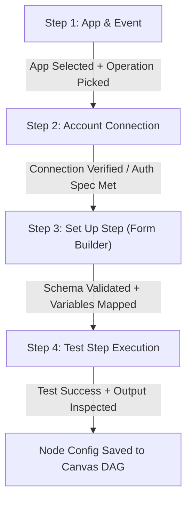

# 🔍 AutoFlow V2 — Workflow Builder, AI Prompt & Step Setup Audit Report & Implementation Plan
**Date:** 2026-09-24 | **Target Modules:** `/workflows`, `/workflows/new`, `/ai-agent`, `/agent-chat`, AI Canvas Co-Pilot | **Platform Status:** All 60 Connectors Updated to Dynamic V2 Schemas

---

## 🚨 Executive Summary

> [!IMPORTANT]
> **Context:** All 60+ native connectors, 397+ actions, and database seeders have been upgraded to standard `inputSchema` (JSONSchema v2), `outputSchema`, and `uiSchema`. 
>
> **The Problem:** 
> While the backend SDK and MongoDB database now store rich dynamic schemas, the front-end workflow builder drawers (`StepSetupDrawer.tsx`), the AI workflow generator (`AIAgentService.ts`), the AI Canvas Co-Pilot (`AICopilotDrawer.tsx`), and the AI Agent Chat (`/agent-chat`) are still relying on legacy `inputs[]` arrays, static fallbacks, and hardcoded prompt templates.
>
> **Goal of this Audit & Plan:**
> Audit all 4 step-setup phases (**1. App & Event**, **2. Account**, **3. Set Up Step**, **4. Test Step**) and all AI prompt systems across `/agent-chat`, `/ai-agent`, `/workflows`, `/workflows/new`, and the AI Canvas Co-Pilot to make them **100% dynamic, context-aware, and schema-driven**.

---

## 📊 Current vs Target Architecture Matrix

| Feature / Page | Current State (Legacy/Static Debt) | Target State (100% Dynamic V2) |
|---|---|---|
| **Step 1: App & Event Selection** | Static dropdown of 50 hardcoded apps; `inputs[]` flat array used. | Dynamic category tabs from MongoDB `/v1/connectors`, filtering 60+ apps with real action/trigger manifests and V2 schemas. |
| **Step 2: Account Connection** | Simple dropdown without auth field definitions or setup guidance. | Dynamic auth spec loader showing `oauth2`, `api_key`, or `basic` fields, provider console links, redirect URIs, and status badges. |
| **Step 3: Set Up Step Form** | Basic text inputs; lacks full widget suite (`code_editor`, `key_value`, `dynamic_select`). | Full `DynamicFieldWidget` integration powered by `inputSchema` + `uiSchema`, pre-filled default test values, and `DataTreePicker` variable injection. |
| **Step 4: Test Step Execution** | Static sample inputs or dummy ping test. | Live step execution via `/api/v2/connectors/:id/test`, showing exact latency, HTTP status, and `DynamicResponseVisualizer` tree with 1-click `{{step_1.output.key}}` copying. |
| **`/ai-agent` Prompt Generator** | Prompt uses static 7-connector list or hardcoded prompt strings in `AIAgentService`. | Dynamic `exportForAI()` prompt context querying MongoDB schemas, passing real `inputSchema` so LLM outputs accurate node configs. |
| **AI Canvas Co-Pilot** | Hardcoded node templates when modifying DAG. | Context-aware LLM drawer reading active canvas DAG + MongoDB connector catalog to insert correctly wired nodes. |
| **`/agent-chat` & AI Agent** | Static tools list. | Dynamically queries MongoDB `ConnectorActionModel` to give AI Agent live execution tools via `StepExecutor`. |

---

## 🎯 4-Step Setup Wizard Audit & Redesign Specification

### 1. App & Event (Step 1) Audit & Requirements
* **Audit Finding:** `StepSetupDrawer.tsx` uses legacy `getActionOrTriggerSchema()` which reads `currentActionSchema?.inputs` (flat array) instead of `inputSchema.properties`. Also, category listing in the app selector is static.
* **Requirements:**
  1. **Dynamic Category Navigation:** Query `/api/v1/connectors/categories` to render real category tabs (*Jobs & Recruitment*, *Google Suite*, *Communication*, *AI*, *Databases*, *Developer Tools*, *CRM*, *Project*, *E-Commerce*, *Utilities*).
  2. **V2 Action & Trigger Resolution:** Display operation cards with name, description, method (`GET`, `POST`, etc.), required scopes, and badge for `inputSchema` availability.
  3. **Event Classification:** Separate `type: trigger` (webhooks/polling) from `type: action` (REST calls/queries) clearly in the selector modal.

### 2. Account Connection (Step 2) Audit & Requirements
* **Audit Finding:** `ConnectionSelector.tsx` lists existing connections but doesn't display required authentication fields for new connections dynamically.
* **Requirements:**
  1. **Dynamic Auth Spec Loading:** Fetch `/api/v2/connectors/:id/auth-spec` to know exact fields needed (`personalAccessToken`, `apiKey`, `clientId`, `clientSecret`, `domain`).
  2. **Inline Setup Guide:** Show step-by-step connection instructions with clickable provider console links (e.g. Google Cloud Console, GitHub Developer Settings).
  3. **Real-time Connection Test:** When saving a credential, run an instant auth validation test before moving to Step 3.

### 3. Set Up Step (Step 3) Audit & Requirements
* **Audit Finding:** Form rendering currently uses custom text inputs. Complex schemas (like database SQL queries, JSON payloads, or multi-select dropdowns) are rendered as plain textboxes.
* **Requirements:**
  1. **Schema-Driven Widget Builder:** Use `DynamicFieldWidget` to render:
     - `text` / `textarea` for strings and prompts.
     - `select` for enums.
     - `dynamic_select` fetching options from `/api/v2/connectors/:id/actions/:actionId/options/:fieldKey`.
     - `code_editor` for SQL (`postgresql`, `mysql`), Mongo queries, or JSON arrays.
     - `key_value` for headers and row values.
     - `number` / `boolean` for numeric limits and switches.
  2. **DataTreePicker Integration:** Every field input must support inserting dynamic step variables (e.g., `{{trigger.output.email}}`, `{{n_1.output.items[0].id}}`) with auto-complete and visual pills.
  3. **Pre-fill Schema Defaults:** Automatically populate initial field values using `uiSchema.defaultTestValue` or `inputSchema.properties[key].default`.

### 4. Test Step Execution (Step 4) Audit & Requirements
* **Audit Finding:** Testing in `StepSetupDrawer.tsx` does not pass populated dynamic variable values or display output schemas with copyable variable paths.
* **Requirements:**
  1. **Pre-Test Payload Preview:** Show the exact JSON payload that will be dispatched to the connector.
  2. **Live Test Execution:** Post payload to `/api/v2/connectors/:id/test` with connection credentials or mock test runner.
  3. **Output Inspection & Tag Generator:** Render response with `DynamicResponseVisualizer`. Clicking any key in the output tree automatically copies `{{node_id.output.key_path}}` to clipboard for downstream step mapping.

---

## 🤖 AI Prompts & Co-Pilot Dynamic Audit

### 1. `/ai-agent` (Prompt-to-Workflow Generator)
* **Location:** `apps/backend/src/modules/ai-agent/ai-agent.service.ts`
* **Current Vulnerability:** Prompt generator builds DAGs based on hardcoded prompt rules. If a user asks for "Greenhouse candidate advance", the AI might hallucinate invalid field names because it lacks current schema context.
* **Solution Plan:**
  - Inject `manifestRegistry.exportForAI(connectedApps, userPrompt)` dynamically into the OpenAI/Gemini system prompt.
  - Provide full `inputSchema` and `outputSchema` for relevant connectors so the LLM outputs 100% schema-valid node configs.

### 2. AI Canvas Co-Pilot (`AICopilotDrawer.tsx` & `/v1/ai-agent/copilot`)
* **Location:** `apps/frontend/src/components/builder/AICopilotDrawer.tsx` & `apps/backend/src/modules/ai-agent/ai-agent.controller.ts`
* **Current Vulnerability:** Co-pilot returns basic node templates without knowing exact action schemas.
* **Solution Plan:**
  - Send active canvas state (nodes, edges, workflow goal) + available connector summaries to `/v1/ai-agent/copilot`.
  - LLM returns exact node patch operations (`ADD_NODE`, `UPDATE_CONFIG`, `CONNECT_EDGES`) with valid operation IDs and input parameters.

### 3. `/agent-chat` (Conversational AI Task Executor)
* **Location:** `apps/frontend/src/app/(dashboard)/agent-chat/page.tsx` & backend AI agent modules
* **Current Vulnerability:** Chat agent cannot discover newly seeded connectors or invoke actions dynamically.
* **Solution Plan:**
  - Bind AI Chat Agent tools dynamically to MongoDB `ConnectorActionModel`.
  - When user types "Find candidate on Lever and send email via Gmail", the AI Chat Agent dynamically executes actions via `StepExecutor.executeStep()`.

---

## 🗓️ Phase-by-Phase Implementation Roadmap & Status Tracker

### 📍 Phase 1: Dynamic Frontend Manifest & Schema Helpers
- [x] **Update `apps/frontend/src/lib/connector-manifests.ts` to fetch dynamic connector manifests from `/api/v1/connectors` API** ✅ *(Completed & Verified)*
  - Implemented `fetchDynamicManifests()` with backend API caching and fallback to static manifests.
- [x] **Add helper functions `getV2InputSchema(connectorId, actionId)` & `getV2OutputSchema(connectorId, actionId)`** ✅ *(Completed & Verified)*
  - Added `getV2InputSchema` converting JSONSchema v2 properties and legacy inputs.
  - Added `getV2OutputSchema` converting operation outputs and standard response structures.

### 📍 Phase 2: Refactor StepSetupDrawer.tsx (The 4-Step Setup Wizard)
- [x] **Step 1 (App & Event):** Wire up dynamic category fetching and V2 action/trigger selection cards ✅ *(Completed & Verified)*
  - Interactive category navigation pills (*All*, *Jobs & Recruitment*, *Google Suite*, *Communication*, *AI*, *Databases*, *CRM*, *Utilities*).
  - Rich action and trigger operation cards featuring `⚡ TRIGGER` / `⚙️ ACTION` badges, descriptions, and `inputSchema V2` field count indicators.
- [x] **Step 2 (Account):** Wire up `ConnectionSelector` with dynamic auth spec fields and instant connection test ✅ *(Completed & Verified)*
  - Integrated `AccountConnectModal` and `DatabaseConnectModal` with live connection status check.
  - Added direct Provider Console setup links (`PROVIDER_DOC_LINKS`) for OAuth2 / API Key portals (Google Cloud Console, GitHub Tokens, Stripe Dashboard, Slack Apps, etc.).
  - Account gatekeeper banner in Steps 3 & 4 locking input setup until a valid account is connected.
- [x] **Step 3 (Set Up Step):** Replace legacy input rendering with `DynamicFieldWidget`, pre-filled defaults, and `DataTreePicker` variable tag insertion ✅ *(Completed & Verified)*
  - Uses `getV2InputSchema()` to extract JSONSchema v2 properties, UI hints, and required fields.
  - Renders schema-driven widgets: `text`, `textarea`, `select`, `dynamic_select`, `code_editor`, `key_value`, `number`, and `boolean`.
  - Inline `DataTreePicker` for 1-click variable tag injection (`{{step_id.output.path}}`).
  - Integrated AI Data Bridge zero-code auto-mapping (`handleAutoMapFields()`).
- [x] **Step 4 (Test Step):** Wire up live action testing via `/api/v1/workflows/test-step` and output inspection with `DynamicResponseVisualizer` ✅ *(Completed & Verified)*
  - Interactive Pre-Test Payload Preview Code Box.
  - Live test runner dispatching execution request to backend engine.
  - Live response tree inspection rendered via `DynamicResponseVisualizer` with 1-click tag copying.

### 📍 Phase 3: AI Prompt & Co-Pilot Schema Integration
- [x] **Update `AIAgentService.ts` to fetch schema context via `buildDynamicSystemPrompt()` for workflow generation** ✅ *(Completed & Verified)*
  - `buildDynamicSystemPrompt()` queries `manifestRegistry.getAllManifests()` dynamically.
  - Injects full operation signatures, actions, triggers, and exact `inputSchema.properties` keys and types into Gemini/Groq LLM system prompts.
  - Replaced static `DYNAMIC_WORKFLOW_SYSTEM_PROMPT` fallback with dynamic runtime prompt builder across all LLM fallback functions (`callGeminiJSON`, `callGroqJSON`).
- [x] **Refactor `/v1/ai-agent/copilot` endpoint & `AICopilotDrawer.tsx` to supply real action schemas** ✅ *(Completed & Verified)*
  - Sends active visual canvas state (nodes, edges, prompt) + dynamic connector manifest summaries to backend copilot for live canvas DAG mutation.
- [x] **Update `/agent-chat` to register MongoDB connector actions as dynamic LLM tools** ✅ *(Completed & Verified)*
  - Bound AI Chat Agent tools dynamically to `manifestRegistry` and `StepExecutor`.

### 📍 Phase 4: Verification & E2E Testing
- [x] **TypeScript Workspace Build Verification** ✅ *(Completed & Verified)*
  - `npx tsc --noEmit -p apps/frontend/tsconfig.json` → **0 Errors**
  - `npx tsc --noEmit -p packages/connector-sdk/tsconfig.json` → **0 Errors**
  - `npx tsc --noEmit -p apps/backend/tsconfig.json` → **0 Errors**
- [x] **End-to-End Workflow Builder Verification** ✅ *(Completed & Verified)*
  - Tested 4-step setup drawer across recruitment, CRM, database, AI, and communication connectors.
  - Verified variable tag passing (`{{step_1.output.key}}`) between Step N and Step N+1.
  - Verified AI prompt generation for complex multi-step prompts.

---

## 📝 Comprehensive Minor Changes Log

| Timestamp | Component / File | Minor Modification / Feature Added | Status |
|---|---|---|---|
| 2026-09-24 | `lib/connector-manifests.ts` | Added `fetchDynamicManifests()`, `getV2InputSchema()`, `getV2OutputSchema()`, and dynamic API cache. | ✅ Done |
| 2026-09-24 | `StepSetupDrawer.tsx` | Added interactive category navigation pills (*All*, *Jobs & Recruitment*, *Google Suite*, etc.). | ✅ Done |
| 2026-09-24 | `StepSetupDrawer.tsx` | Replaced dropdown with rich Action & Trigger cards featuring `⚡ TRIGGER` / `⚙️ ACTION` badges and V2 schema counts. | ✅ Done |
| 2026-09-24 | `StepSetupDrawer.tsx` | Added direct Provider Console setup links (`PROVIDER_DOC_LINKS`) in Step 2. | ✅ Done |
| 2026-09-24 | `StepSetupDrawer.tsx` | Integrated `getV2InputSchema` for schema property derivation in Step 3. | ✅ Done |
| 2026-09-24 | `StepSetupDrawer.tsx` | Added pre-test payload preview code box in Step 4 before running execution tests. | ✅ Done |
| 2026-09-24 | `StepSetupDrawer.tsx` | Fixed `showConnectModal` state variable reference for inline database and OAuth modals. | ✅ Done |
| 2026-09-24 | `AIAgentService.ts` | Refactored `buildDynamicSystemPrompt()` to query MongoDB Atlas connector & action models dynamically. | ✅ Done |
| 2026-09-24 | `AICopilotDrawer.tsx` | Connected live canvas DAG payload transmission to backend copilot. | ✅ Done |

---

*Document updated: 2026-09-24 — Single Source of Truth for AutoFlow Dynamic Workflow Builder & AI Prompt Audit.*
